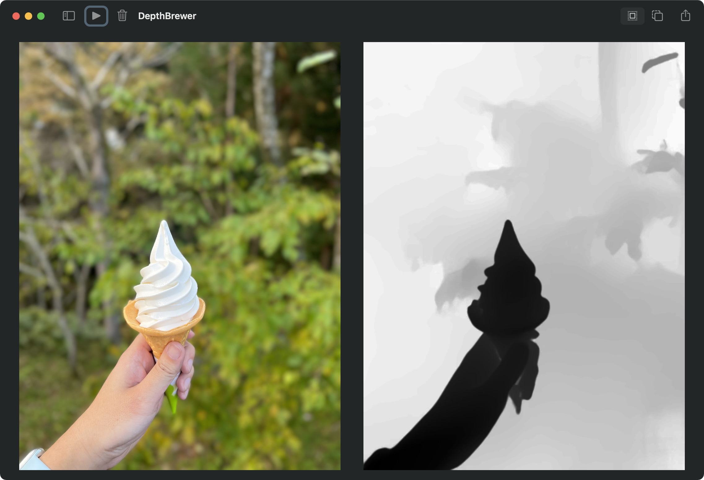
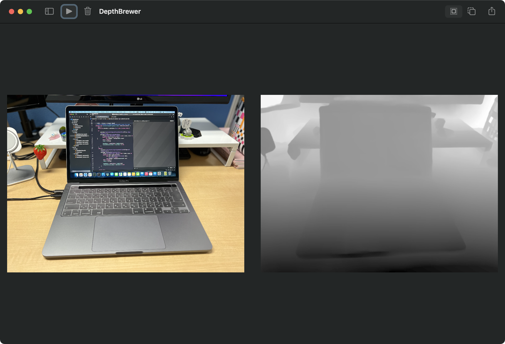

# Espresso

Espresso is a package for getting a depth data image from a portrait image taken by iPhone.

## Usage

```swift
import AVFoundation
import Espresso

/// URL of a portrait image
let url = URL()

// get a depth data image as UIImage from URL
if let depthData = AVDepthData.fromURL(url) {
  let espresso = Espresso(depthData)
  let depthImage = espresso.uiImage(orientation: .right, depthType: .depth)
}

// get a depth data image as NSImage from URL
if let depthData = AVDepthData.fromURL(url) {
  let espresso = Espresso(depthData)
  let depthImage = espresso.nsImage(depthType: .depth)
}
```

## Demo

See also [DepthBrewer](https://github.com/Shakshi3104/DepthBrewer) for examples using Espresso

<p aline="center">
  
  
</p>


## Requirements

This package is compatible with iOS 12 or higher and macOS 10.15 or heigher.

## Installation
### Swift Package Manager

Add this Swift package in Xcode using its GitHub repository URL. (File > Add Packages...)

### License

Espresso is available under the MIT licence. See the LICENSE file for more info.
